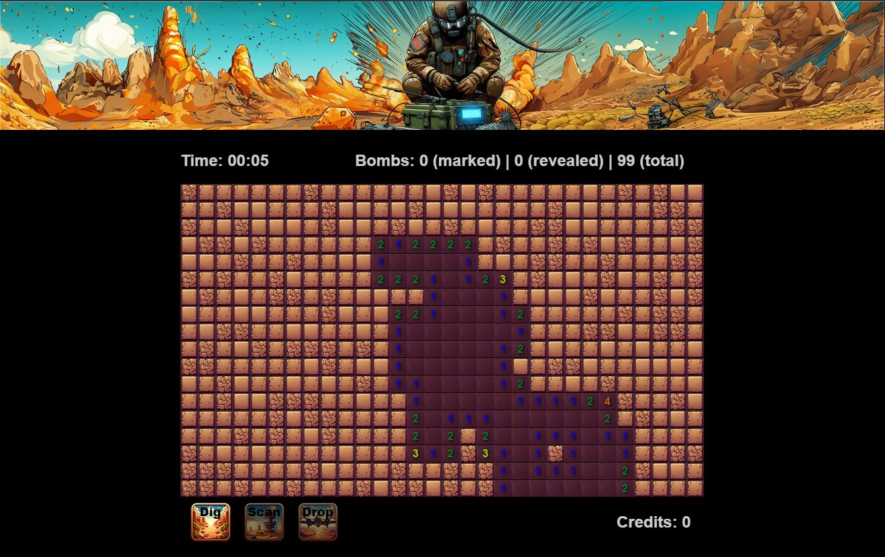

# BoomGuard

You know the game - you have to uncover 99 bombs.

⚠️This is a hobby game. Feel free to submit feature ideas - maybe I'll find the time in the far away future to implement them 😂.

## Play it
https://matthiasbruch.github.io/boomguard/

## Instructions
**Basic controls**
- Left click: Uncover a field. It can go boom.
- Right click: Mark a field as safe. You only should do this if you're sure about it or you might get confused.
- Middle click: Uncovers all fields around the cursor... and yes ... all of them can go boom.

**Actions**
- Dig: Lets you uncover a field in a save way. It just costs time. Uncovering a mine (even when marked safe before) gives you [1 Credit].
- Scan: [2 Credits] Reveals what is behind covered fields. It reveals the selected field and those directly attached.
- Drop: [8 Credits] Carpet bombs a row of fields. Bombs on this line are deactivated and count as uncovered.

## Screenshot

    

